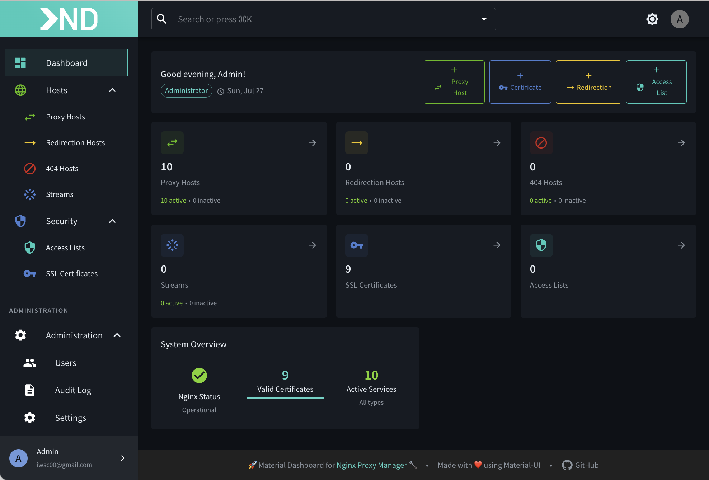

# 🚀 NPMDeck - Modern Frontend for Nginx Proxy Manager

<div align="center">
  
  
  [](https://github.com/smartlabsAT/NPMDeck)
  [](LICENSE)
  [](https://nodejs.org)
</div>

---

## 🎯 What is NPMDeck?

NPMDeck is a **modern, responsive web interface** for [Nginx Proxy Manager](https://nginxproxymanager.com/). Built with React, Material-UI, and Express.js, it provides an improved user experience with powerful features and a beautiful design.

### 🔒 Privacy & Security First

> [!IMPORTANT]
> **NPMDeck does NOT access your database directly!**
> 
> NPMDeck works exclusively through the official Nginx Proxy Manager API. This means:
> - ✅ **No database access** - We never touch your database
> - ✅ **API-only communication** - All operations go through NPM's REST API
> - ✅ **No data storage** - NPMDeck doesn't store any of your data
> - ✅ **Secure by design** - Same security as the official NPM interface
> - ✅ **Compatible** - Works with any NPM installation that has API access

## ✨ Features

- 🌓 **Dark Mode** - Built-in dark theme with system preference detection
- 🔍 **Global Search** - Search across all resources
- 🎨 **Customizable UI** - Choose between drawer and dialog views
- 🔒 **Permission System** 
- ⚡ **Blazing Fast** - Built with Vite and React 18 for optimal performance
- 🎯 **Smart Filters** - Advanced filtering and sorting options
- 🌐 **Enhanced Domain Input** - Smart URL parsing with automatic cleaning and validation

## 📋 Prerequisites

- ✅ Node.js 20+ (LTS recommended)
- 📦 pnpm 8+ (Package Manager)
- 🐳 Docker (optional, for containerized deployment)
- 🔧 Running instance of Nginx Proxy Manager backend

## 🛠️ Development Setup

### 🚀 Quick Start

```bash
# 1. Clone the repository
git clone https://github.com/smartlabsAT/NPMDeck.git
cd NPMDeck

# 2. Install pnpm (if not already installed)
npm install -g pnpm

# 3. Install dependencies
pnpm install

# 4. Configure environment
cp .env.example .env
# Edit .env with your NPM backend URL
```

### ⚙️ Configure Environment

Edit `.env` and set your NPM backend URL:
```env
NPM_API_URL=http://localhost:81  # Your NPM backend address
PORT=3000                         # Express server port
```

### 💻 Start Development

```bash
pnpm run dev
```

This starts two servers simultaneously:
- 🔥 **Vite Dev Server**: http://localhost:5173 (React app with hot reload)
- 🚀 **Express Server**: http://localhost:3000 (API proxy to NPM backend)

Open http://localhost:5173 in your browser for development.

### 🐳 Development with Docker

```bash
docker-compose up dev
```

This starts:
- 🔄 NPMDeck development container with hot reload
- 👀 Watches for file changes and automatically rebuilds

## 🚀 Production Deployment

### Option 1: Node.js Deployment

```bash
# Build the application
pnpm run build

# Start production server
pnpm start
```

The application will be available at http://localhost:3000

### Option 2: Docker Deployment (Recommended) 🐳

#### Build the Docker Image

```bash
# Build the image
docker build -t npmdeck:latest .
```

#### Complete Docker Compose Setup with NPM

Create a `docker-compose.yml` file:

```yaml
version: '3.8'

services:
  nginx-proxy-manager:
    image: 'jc21/nginx-proxy-manager:latest'
    container_name: npm
    restart: unless-stopped
    ports:
      - '80:80'
      - '443:443'
      - '81:81'
    environment:
      - DB_MYSQL_HOST=db
      - DB_MYSQL_PORT=3306
      - DB_MYSQL_USER=npm
      - DB_MYSQL_PASSWORD=${MYSQL_PASSWORD}
      - DB_MYSQL_NAME=npm
    volumes:
      - ./data:/data
      - ./letsencrypt:/etc/letsencrypt
    networks:
      - proxy
    depends_on:
      - db

  db:
    image: 'mariadb:10.11'
    container_name: npm-db
    restart: unless-stopped
    environment:
      - MYSQL_ROOT_PASSWORD=${MYSQL_ROOT_PASSWORD}
      - MYSQL_DATABASE=npm
      - MYSQL_USER=npm
      - MYSQL_PASSWORD=${MYSQL_PASSWORD}
    volumes:
      - ./mysql:/var/lib/mysql
    networks:
      - proxy

  npmdeck:
    image: npmdeck:latest
    container_name: npmdeck
    restart: unless-stopped
    ports:
      - '82:3000'  # Access NPMDeck on port 82
    environment:
      # For macOS Docker Desktop use:
      - NPM_API_URL=http://host.docker.internal:81
      # For Linux or container-to-container:
      # - NPM_API_URL=http://nginx-proxy-manager:81
    depends_on:
      - nginx-proxy-manager
    networks:
      - proxy

networks:
  proxy:
    driver: bridge
```

> [!IMPORTANT]
> **macOS Users**: Use `host.docker.internal` for NPM_API_URL when NPM runs on the host or in another Docker network.
> 
> **Linux Users**: Use the container name (e.g., `nginx-proxy-manager`) for container-to-container communication.

Start everything:
```bash
docker-compose up -d
```

Access:
- **NPM Admin**: http://localhost:81
- **NPMDeck**: http://localhost:82
- **Proxy**: http://localhost:80

### Option 3: Standalone Docker Run

```bash
# For macOS (NPM on host or different network)
docker run -d \
  --name npmdeck \
  -p 3000:3000 \
  -e NPM_API_URL=http://host.docker.internal:81 \
  npmdeck:latest

# For Linux or same Docker network
docker run -d \
  --name npmdeck \
  --network npm-network \
  -p 3000:3000 \
  -e NPM_API_URL=http://nginx-proxy-manager:81 \
  npmdeck:latest
```

## 🔧 Environment Variables

| Variable | Description | Default |
|----------|-------------|---------|
| `PORT` | Server port | `3000` |
| `NODE_ENV` | Environment mode | `development` |
| `NPM_API_URL` | NPM backend URL | `http://localhost:81` |


## 🏗️ Architecture

```
NPMDeck/
├── 📁 src/           # React frontend source
├── 📁 server/        # Express backend server
│   ├── 📁 routes/    # API routes
│   ├── 📁 config/    # Server configuration
│   └── 📄 index.js   # Main server file
├── 📁 dist/          # Built frontend (generated)
└── 📁 public/        # Static assets
```

## 🔌 API Integration

NPMDeck acts as a proxy between the frontend and NPM backend:

- ➡️ All `/api/*` requests are proxied to the NPM backend
- 🔐 Authentication headers are automatically forwarded
- 📊 Additional dashboard-specific endpoints at `/api/dashboard/*`

## 💻 Development

### 📜 Available Scripts

- `pnpm run dev` - 🚀 Start development servers (Vite + Express)
- `pnpm run build` - 🏗️ Build for production
- `pnpm start` - ▶️ Start production server
- `pnpm run lint` - 🔍 Run ESLint
- `pnpm run typecheck` - 📝 Run TypeScript type checking
- `pnpm run test` - 🧪 Run tests (when available)
- `pnpm run docker:build` - 🐳 Build Docker image
- `pnpm run docker:run` - 🏃 Run Docker container
- `pnpm run clean` - 🧹 Clean build artifacts

### 🛠️ Tech Stack

- **Frontend**: ⚛️ React 18, TypeScript, Material-UI v5, Vite
- **Backend**: 🟢 Express.js, http-proxy-middleware
- **State Management**: 🐻 Zustand, React Query
- **Routing**: 🛣️ React Router v6
- **Build**: ⚡ Vite, 🐳 Docker

## 🔄 CI/CD & Quality Checks

### GitHub Actions

This project uses GitHub Actions for continuous integration:

- **Code Quality**: Automatic TypeScript and ESLint checks on every push
- **Build Tests**: Ensures the project builds successfully
- **Docker Build**: Validates Docker image creation
- **PR Checks**: Automated quality gates for pull requests

### Local Quality Checks

Before committing, run:

```bash
# Type checking
pnpm run typecheck

# Linting
pnpm run lint

# Build test
pnpm run build
```

## 🤝 Contributing

We love contributions! Here's how you can help:

1. 🍴 Fork the repository
2. 🌟 Create your feature branch (`git checkout -b feature/amazing-feature`)
3. 💾 Commit your changes (`git commit -m 'Add amazing feature'`)
4. 📤 Push to the branch (`git push origin feature/amazing-feature`)
5. 🔄 Open a Pull Request

## 📄 License

This project is licensed under the MIT License - see the [LICENSE](LICENSE) file for details.

## 🙏 Acknowledgments

- 🎯 [Nginx Proxy Manager](https://nginxproxymanager.com/) for the excellent backend
- 💪 The NPM community for feedback and contributions
- ❤️ All our contributors and supporters

## 🔧 Troubleshooting

### Common Issues

**Cannot connect to NPM backend:**
- Ensure NPM is running and accessible
- Check `NPM_API_URL` in your `.env` file
- For Docker: Use `host.docker.internal` on macOS or container name on Linux

**Build fails with TypeScript errors:**
```bash
pnpm run typecheck  # Check for type errors
pnpm run lint       # Check for linting issues
```

**Port already in use:**
- Change the port in `.env` file
- Or stop the conflicting service

## 💬 Support

- 📚 [Documentation](https://github.com/smartlabsAT/NPMDeck/wiki)
- 🐛 [Issue Tracker](https://github.com/smartlabsAT/NPMDeck/issues)
- 💬 [Discussions](https://github.com/smartlabsAT/NPMDeck/discussions)

---

<div align="center">
  Made with ❤️ by <a href="https://github.com/smartlabsAT">smartlabs</a>
  <br>
  ⭐ Star us on GitHub — it motivates us a lot!
</div>