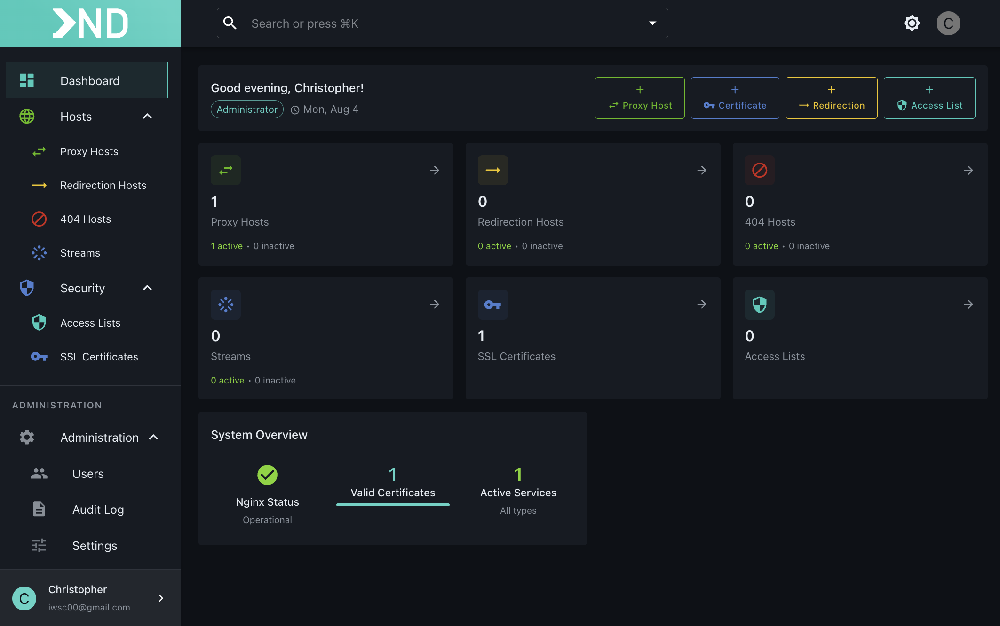

# 🚀 NPMDeck - Modern Frontend for Nginx Proxy Manager

<div align="center">
  
  
  [](https://github.com/smartlabsAT/NPMDeck)
  [](LICENSE)
  [](https://nodejs.org)
</div>

> [!WARNING]
> 🚧 **Development Status**: NPMDeck is currently under active development. A stable release is coming soon! 
> 
> ⭐ **Star & Watch** this repository to get notified about the release!

---

## 🎯 What is NPMDeck?

NPMDeck is a **modern, responsive web interface** for [Nginx Proxy Manager](https://nginxproxymanager.com/). Built with React, Material-UI, and Express.js, it provides an improved user experience with powerful features and a beautiful design.

## ✨ Features

- 🌓 **Dark Mode** - Built-in dark theme with system preference detection
- 🔍 **Global Search** - Lightning-fast search across all resources
- 🎨 **Customizable UI** - Choose between drawer and dialog views
- 📊 **Enhanced Dashboard** - Real-time statistics and quick actions
- 🔒 **Permission System** - Fine-grained access control
- 📱 **Responsive Design** - Works seamlessly on desktop, tablet, and mobile
- ⚡ **Blazing Fast** - Built with Vite and React 18 for optimal performance
- 🔄 **Live Updates** - Real-time data synchronization
- 🎯 **Smart Filters** - Advanced filtering and sorting options

## 📋 Prerequisites

- ✅ Node.js 18+ 
- 🐳 Docker (optional, for containerized deployment)
- 🔧 Running instance of Nginx Proxy Manager backend

## 🛠️ Development Setup

### 🚀 Quick Start

```bash
# 1. Clone the repository
git clone https://github.com/smartlabsAT/NPMDeck.git
cd NPMDeck

# 2. Install dependencies
npm install

# 3. Configure environment
cp .env.example .env
# Edit .env with your NPM backend URL
```

### ⚙️ Configure Environment

Edit `.env` and set your NPM backend URL:
```env
NPM_API_URL=http://localhost:81  # Your NPM backend address
PORT=3000                         # Express server port
```

### 💻 Start Development

```bash
npm run dev
```

This starts two servers simultaneously:
- 🔥 **Vite Dev Server**: http://localhost:5173 (React app with hot reload)
- 🚀 **Express Server**: http://localhost:3000 (API proxy to NPM backend)

Open http://localhost:5173 in your browser for development.

### 🐳 Development with Docker

```bash
docker-compose up dev
```

This starts:
- 🔄 NPMDeck development container with hot reload
- 👀 Watches for file changes and automatically rebuilds

## 🚀 Production Deployment

### Option 1: Node.js Deployment

```bash
# Build the application
npm run build

# Start production server
npm start
```

The application will be available at http://localhost:3000

### Option 2: Docker Deployment (Recommended) 🐳

#### Using Docker Compose

```bash
# Start production container
docker-compose up -d prod

# View logs
docker-compose logs -f prod

# Stop container
docker-compose down
```

#### Using Docker directly

```bash
# Build the image
docker build -t npmdeck:latest .

# Run the container
docker run -d \
  --name npmdeck \
  -p 3000:3000 \
  -e NPM_API_URL=http://your-npm-backend:81 \
  -e NODE_ENV=production \
  npmdeck:latest

# View logs
docker logs -f npmdeck

# Stop container
docker stop npmdeck
docker rm npmdeck
```

### Option 3: Docker with Custom Network 🌐

If NPM backend runs in Docker, use a shared network:

```bash
# Create network (if not exists)
docker network create npm-network

# Run NPMDeck
docker run -d \
  --name npmdeck \
  --network npm-network \
  -p 3000:3000 \
  -e NPM_API_URL=http://nginx-proxy-manager:81 \
  npmdeck:latest
```

## 🔧 Environment Variables

| Variable | Description | Default |
|----------|-------------|---------|
| `PORT` | Server port | `3000` |
| `NODE_ENV` | Environment mode | `development` |
| `NPM_API_URL` | NPM backend URL | `http://localhost:81` |
| `ENABLE_LOGS` | Enable log features | `true` |
| `ENABLE_METRICS` | Enable metrics | `true` |

## 🏗️ Architecture

```
NPMDeck/
├── 📁 src/           # React frontend source
├── 📁 server/        # Express backend server
│   ├── 📁 routes/    # API routes
│   ├── 📁 config/    # Server configuration
│   └── 📄 index.js   # Main server file
├── 📁 dist/          # Built frontend (generated)
└── 📁 public/        # Static assets
```

## 🔌 API Integration

NPMDeck acts as a proxy between the frontend and NPM backend:

- ➡️ All `/api/*` requests are proxied to the NPM backend
- 🔐 Authentication headers are automatically forwarded
- 📊 Additional dashboard-specific endpoints at `/api/dashboard/*`

## 💻 Development

### 📜 Available Scripts

- `npm run dev` - 🚀 Start development servers
- `npm run build` - 🏗️ Build for production
- `npm start` - ▶️ Start production server
- `npm run lint` - 🔍 Run ESLint
- `npm run docker:build` - 🐳 Build Docker image
- `npm run docker:run` - 🏃 Run Docker container

### 🛠️ Tech Stack

- **Frontend**: ⚛️ React 18, TypeScript, Material-UI v5, Vite
- **Backend**: 🟢 Express.js, http-proxy-middleware
- **State Management**: 🐻 Zustand, React Query
- **Routing**: 🛣️ React Router v6
- **Build**: ⚡ Vite, 🐳 Docker

## 🤝 Contributing

We love contributions! Here's how you can help:

1. 🍴 Fork the repository
2. 🌟 Create your feature branch (`git checkout -b feature/amazing-feature`)
3. 💾 Commit your changes (`git commit -m 'Add amazing feature'`)
4. 📤 Push to the branch (`git push origin feature/amazing-feature`)
5. 🔄 Open a Pull Request

## 📄 License

This project is licensed under the MIT License - see the [LICENSE](LICENSE) file for details.

## 🙏 Acknowledgments

- 🎯 [Nginx Proxy Manager](https://nginxproxymanager.com/) for the excellent backend
- 💪 The NPM community for feedback and contributions
- ❤️ All our contributors and supporters

## 💬 Support

- 📚 [Documentation](https://github.com/smartlabsAT/NPMDeck/wiki)
- 🐛 [Issue Tracker](https://github.com/smartlabsAT/NPMDeck/issues)
- 💬 [Discussions](https://github.com/smartlabsAT/NPMDeck/discussions)

---

<div align="center">
  Made with ❤️ by <a href="https://github.com/smartlabsAT">smartlabs</a>
  <br>
  ⭐ Star us on GitHub — it motivates us a lot!
</div>