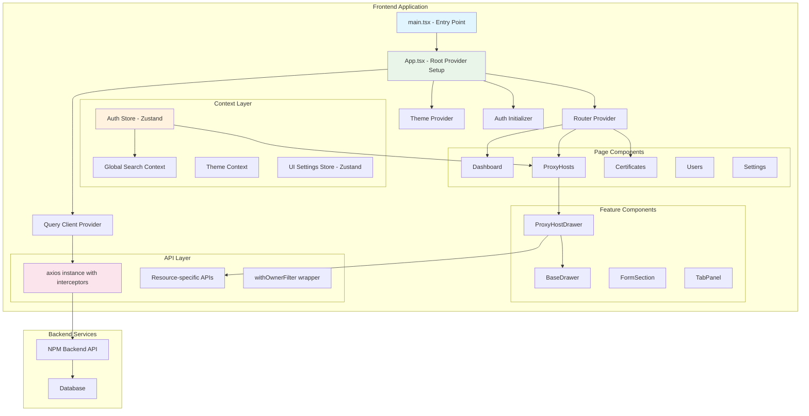
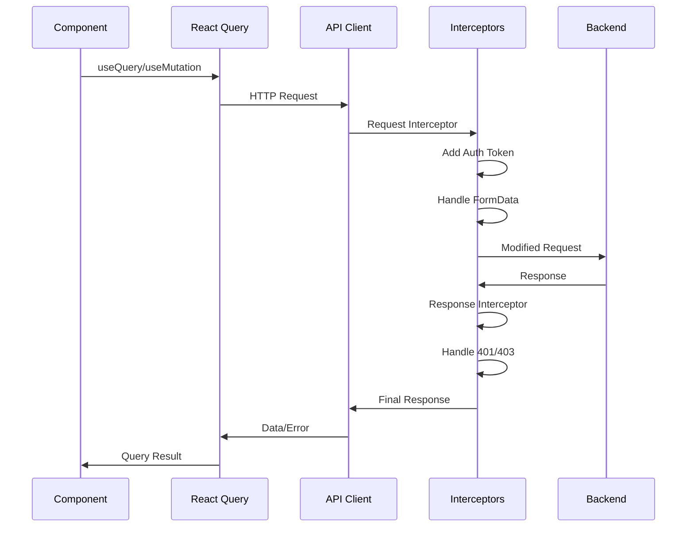
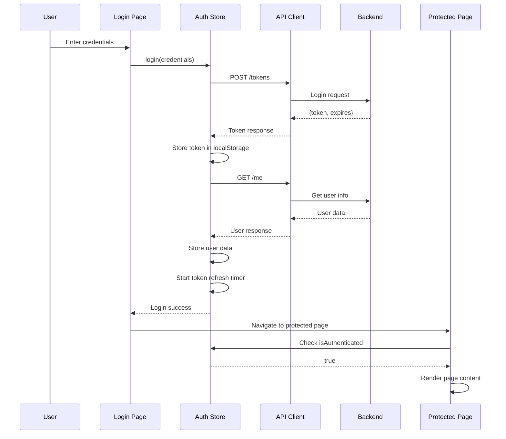

# Frontend Integration Documentation - Nginx Proxy Manager

This document provides a comprehensive overview of ALL integration points and data flows in the nginx-proxy-manager frontend. It serves as the definitive guide for understanding how different parts of the system work together.

## Table of Contents

1. [System Architecture Overview](#system-architecture-overview)
2. [Component Communication Patterns](#component-communication-patterns)
3. [Data Flow Architecture](#data-flow-architecture)
4. [State Management Integration](#state-management-integration)
5. [API Integration Patterns](#api-integration-patterns)
6. [Cache Strategies & Usage](#cache-strategies--usage)
7. [Real-time Updates](#real-time-updates)
8. [Error Propagation & Handling](#error-propagation--handling)
9. [Navigation & Routing Flows](#navigation--routing-flows)
10. [External Integrations](#external-integrations)
11. [Inter-Component Dependencies](#inter-component-dependencies)
12. [Critical Integration Points](#critical-integration-points)

---

## System Architecture Overview

### High-Level Integration Flow



### Provider Hierarchy

The application follows a strict provider hierarchy that ensures proper context flow:

```typescript
<ErrorBoundary>
  <QueryClientProvider client={queryClient}>
    <ThemeProvider>
      <AuthInitializer>
        <RouterProvider router={router} />
      </AuthInitializer>
    </ThemeProvider>
  </QueryClientProvider>
</ErrorBoundary>
```

---

## Component Communication Patterns

### 1. Parent-Child Communication

#### Props Down Pattern
```typescript
// Parent passes data and handlers to child
<ProxyHostDrawer
  open={drawerOpen}
  onClose={handleClose}
  host={selectedHost}
  onSave={handleSave}
/>
```

#### Callback Up Pattern
```typescript
// Child calls parent handlers to communicate changes
const ProxyHostDrawer = ({ onClose, onSave }) => {
  const handleSubmit = async () => {
    await submitForm()
    onSave() // Notify parent of successful save
    onClose() // Request parent to close drawer
  }
}
```

### 2. Context-Based Communication

#### Global Search Context
```typescript
// GlobalSearchContext provides cross-component search capabilities
const GlobalSearchProvider = ({ children }) => {
  const [searchState, setSearchState] = useState({
    isLoading: false,
    data: {
      proxy_hosts: [],
      certificates: [],
      users: [],
      // ... all resource types
    },
    lastFetch: 0
  })

  // Preloads ALL resource types for global search
  const preloadData = useCallback(async () => {
    const results = await Promise.allSettled([
      proxyHostsApi.getAll(),
      certificatesApi.getAll(),
      usersApi.getAll(),
      // ... all APIs
    ])
    // Updates centralized search data
  }, [])
}
```

#### Theme Context Integration
```typescript
// Theme context provides consistent theming across all components
const ThemeProvider = ({ children }) => {
  const [mode, setMode] = useState('dark') // Default to dark
  
  // Listens for system theme changes
  useEffect(() => {
    const mediaQuery = window.matchMedia('(prefers-color-scheme: dark)')
    const handleChange = (e) => {
      if (!localStorage.getItem(THEME_KEY)) {
        setMode(e.matches ? 'dark' : 'light')
      }
    }
    mediaQuery.addEventListener('change', handleChange)
  }, [])
}
```

### 3. Store-Based Communication

#### Zustand Auth Store
```typescript
// Central authentication state shared across entire app
export const useAuthStore = create((set, get) => ({
  user: null,
  token: localStorage.getItem('npm_token'),
  isAuthenticated: !!localStorage.getItem('npm_token'),
  
  // Complex permission system integrated throughout
  hasPermission: (resource, level) => hasPermission(get().user, resource, level),
  canView: (resource) => canView(get().user, resource),
  canManage: (resource) => canManage(get().user, resource),
  
  // Token management with automatic refresh
  refreshToken: async () => {
    const response = await authApi.refreshToken()
    localStorage.setItem('npm_token', response.token)
    set({ token: response.token })
  }
}))
```

#### UI Settings Store
```typescript
// Persisted UI preferences
export const useUISettingsStore = create()(
  persist(
    (set, get) => ({
      containerPreferences: {
        proxy_hosts: { create: 'drawer', edit: 'drawer' },
        certificates: { create: 'dialog', edit: 'drawer' }
      },
      drawerPosition: 'right',
      drawerWidth: 600,
      
      setContainerPreference: (entity, operation, type) => {
        // Updates component rendering preferences
      }
    }),
    { name: 'npm-ui-settings' }
  )
)
```

---

## Data Flow Architecture

### 1. API Request Flow



#### Request Interceptor Flow
```typescript
// Automatic token injection and FormData handling
api.interceptors.request.use((config) => {
  const token = localStorage.getItem('npm_token')
  if (token && config.headers) {
    config.headers.Authorization = `Bearer ${token}`
  }
  
  // Special handling for file uploads
  if (config.data instanceof FormData) {
    delete config.headers['Content-Type'] // Let browser set boundary
  }
  
  return config
})
```

#### Response Interceptor Flow
```typescript
// Automatic token refresh and error handling
api.interceptors.response.use(
  (response) => response,
  async (error) => {
    const originalRequest = error.config

    // Handle permission denied
    if (error.response?.status === 403) {
      if (!window.location.pathname.includes('/403')) {
        window.location.href = '/403'
      }
      return Promise.reject(error)
    }

    // Handle token expiry with automatic refresh
    if (error.response?.status === 401 && !originalRequest._retry) {
      originalRequest._retry = true
      
      try {
        const refreshResponse = await api.get('/tokens')
        localStorage.setItem('npm_token', refreshResponse.data.token)
        originalRequest.headers.Authorization = `Bearer ${refreshResponse.data.token}`
        return api(originalRequest) // Retry original request
      } catch (refreshError) {
        // Redirect to login on refresh failure
        localStorage.removeItem('npm_token')
        localStorage.removeItem('npm_user')
        window.location.href = '/login'
      }
    }

    return Promise.reject(error)
  }
)
```

### 2. Form Data Flow

#### useDrawerForm Integration
```typescript
// Complete form lifecycle management
const form = useDrawerForm({
  initialData: proxyHostData,
  fields: {
    domainNames: {
      required: true,
      validate: (domains) => domains.length === 0 ? 'Required' : null
    },
    certificateId: {
      validate: (certId, data) => {
        if (data.sslEnabled && certId <= 0) {
          return 'Certificate required when SSL enabled'
        }
        return null
      }
    }
  },
  onSubmit: async (data) => {
    // Transform form data to API format
    const payload = {
      domain_names: data.domainNames,
      forward_scheme: data.forwardScheme,
      certificate_id: data.sslEnabled ? data.certificateId : undefined
    }
    
    if (isEditMode) {
      await proxyHostsApi.update(host.id, payload)
    } else {
      await proxyHostsApi.create(payload)
    }
  },
  autoSave: {
    enabled: true,
    delay: 3000,
    onAutoSave: async (data) => {
      if (isEditMode && isDirty) {
        // Auto-save draft functionality
      }
    }
  }
})
```

#### Field Validation Flow
```typescript
// Multi-level validation system
const validateField = (key, value, formData) => {
  // 1. Required validation
  if (fieldConfig?.required && !value) {
    return fieldConfig.requiredMessage || `${key} is required`
  }
  
  // 2. Field-specific validation
  if (fieldConfig?.validate) {
    return fieldConfig.validate(value, formData)
  }
  
  // 3. Cross-field validation (e.g., SSL requires certificate)
  if (key === 'certificateId' && formData.sslEnabled && value <= 0) {
    return 'Certificate required when SSL is enabled'
  }
  
  return null
}
```

### 3. Owner-Filtered Data Flow

#### Automatic Owner Filtering
```typescript
// withOwnerFilter wrapper automatically applies user-based filtering
export const withOwnerFilter = <T extends { owner_user_id?: number }>(
  apiClient: any
) => ({
  ...apiClient,
  getAll: async (...args) => {
    const data = await apiClient.getAll(...args)
    const { shouldFilterByUser, user } = useAuthStore.getState()
    
    if (shouldFilterByUser() && user) {
      return data.filter(item => item.owner_user_id === user.id)
    }
    
    return data
  }
})
```

#### Permission-Based Data Access
```typescript
// useFilteredData hook applies visibility rules
export function useFilteredData<T extends HasOwnerId>(data: T[]): T[] {
  const { user, shouldFilterByUser } = useAuthStore()

  return useMemo(() => {
    if (!shouldFilterByUser() || !user) {
      return data // Admin sees all
    }

    // Filter to only user's resources
    return data.filter(item => {
      const ownerId = item.owner?.id || item.owner_user_id
      return ownerId === user.id
    })
  }, [data, user, shouldFilterByUser])
}
```

---

## State Management Integration

### 1. React Query Integration

#### Global Query Configuration
```typescript
const queryClient = new QueryClient({
  defaultOptions: {
    queries: {
      retry: 1,
      refetchOnWindowFocus: false,
      staleTime: 5 * 60 * 1000, // 5 minutes
      cacheTime: 10 * 60 * 1000 // 10 minutes
    }
  }
})
```

#### Resource-Specific Query Patterns
```typescript
// Standardized query patterns for all resources
const useProxyHosts = () => {
  return useQuery({
    queryKey: ['proxyHosts'],
    queryFn: () => proxyHostsApi.getAll(['owner', 'access_list', 'certificate']),
    select: (data) => data.sort((a, b) => a.domain_names[0].localeCompare(b.domain_names[0]))
  })
}

const useCreateProxyHost = () => {
  const queryClient = useQueryClient()
  
  return useMutation({
    mutationFn: proxyHostsApi.create,
    onSuccess: () => {
      queryClient.invalidateQueries(['proxyHosts'])
      toast.success('Proxy host created successfully')
    },
    onError: (error) => {
      toast.error(error.message)
    }
  })
}
```

### 2. Zustand Store Integration

#### Auth Store Token Management
```typescript
// Automatic token refresh system
const useAuthStore = create((set, get) => ({
  refreshInterval: null,
  
  startTokenRefresh: () => {
    const interval = setInterval(() => {
      get().refreshToken()
    }, 15 * 60 * 1000) // Every 15 minutes
    
    set({ refreshInterval: interval })
  },
  
  stopTokenRefresh: () => {
    const { refreshInterval } = get()
    if (refreshInterval) {
      clearInterval(refreshInterval)
      set({ refreshInterval: null })
    }
  }
}))
```

#### UI Settings Persistence
```typescript
// Persistent UI preferences with localStorage
export const useUISettingsStore = create()(
  persist(
    (set, get) => ({
      containerPreferences: {},
      drawerPosition: 'right',
      drawerWidth: 600,
      
      getContainerType: (entity, operation) => {
        const prefs = get().containerPreferences[entity]
        return prefs?.[operation] || 'dialog'
      }
    }),
    {
      name: 'npm-ui-settings',
      version: 1
    }
  )
)
```

### 3. Form State Integration

#### Advanced Form State Management
```typescript
// useDrawerForm provides comprehensive form state
interface FormState<T> {
  data: T                    // Current form data
  errors: Partial<Record<keyof T, string>>  // Field errors
  globalError: string | null // Form-level error
  loading: boolean          // Submit state
  isDirty: boolean         // Change tracking
  touched: Partial<Record<keyof T, boolean>> // Field interaction
  isValid: boolean         // Validation state
  autoSaveStatus: 'idle' | 'saving' | 'saved' | 'error'
}
```

---

## API Integration Patterns

### 1. Standardized API Client Pattern

#### Base API Configuration
```typescript
// Central axios configuration with interceptors
const api = axios.create({
  baseURL: import.meta.env.VITE_API_URL || '/api',
  headers: {
    'Content-Type': 'application/json'
  }
})
```

#### Resource-Specific API Clients
```typescript
// Factory pattern for consistent API clients
const createResourceAPI = <T>(endpoint: string) => ({
  async getAll(include?: string[]): Promise<T[]> {
    const params = include ? { include: include.join(',') } : {}
    const response = await api.get(endpoint, { params })
    return response.data
  },
  
  async get(id: number): Promise<T> {
    const response = await api.get(`${endpoint}/${id}`)
    return response.data
  },
  
  async create(data: CreateData<T>): Promise<T> {
    const response = await api.post(endpoint, data)
    return response.data
  },
  
  async update(id: number, data: UpdateData<T>): Promise<T> {
    const response = await api.put(`${endpoint}/${id}`, data)
    return response.data
  },
  
  async delete(id: number): Promise<void> {
    await api.delete(`${endpoint}/${id}`)
  }
})

// Usage
export const proxyHostsApi = createResourceAPI<ProxyHost>('/nginx/proxy-hosts')
export const certificatesApi = createResourceAPI<Certificate>('/nginx/certificates')
```

### 2. Error Handling Integration

#### Consistent Error Processing
```typescript
// Standardized error handling across all API calls
const getErrorMessage = (error: unknown): string => {
  if (error && typeof error === 'object' && 'response' in error) {
    const axiosError = error as AxiosErrorResponse
    if (axiosError.response?.data?.error?.message) {
      return axiosError.response.data.error.message
    }
    if (axiosError.response?.data?.message) {
      return axiosError.response.data.message
    }
  }
  if (error instanceof Error) {
    return error.message
  }
  return 'An unexpected error occurred'
}
```

### 3. Permission-Based API Access

#### Owner Filter Integration
```typescript
// Automatic owner filtering for multi-tenant resources
export const withOwnerFilter = <T extends { owner_user_id?: number }>(
  apiClient: ResourceAPI<T>
): ResourceAPI<T> => ({
  ...apiClient,
  
  async create(data: CreateData<T>): Promise<T> {
    const { user } = useAuthStore.getState()
    const payload = user ? { ...data, owner_user_id: user.id } : data
    return apiClient.create(payload)
  },
  
  async update(id: number, data: UpdateData<T>): Promise<T> {
    // Verify user owns resource before update
    const existing = await this.get(id)
    const { user, shouldFilterByUser } = useAuthStore.getState()
    
    if (shouldFilterByUser() && existing.owner_user_id !== user?.id) {
      throw new Error('Access denied: You can only modify your own resources')
    }
    
    return apiClient.update(id, data)
  }
})
```

---

## Cache Strategies & Usage

### 1. React Query Cache Configuration

#### Global Cache Settings
```typescript
const queryClient = new QueryClient({
  defaultOptions: {
    queries: {
      staleTime: 5 * 60 * 1000,    // Data stays fresh for 5 minutes
      cacheTime: 10 * 60 * 1000,   // Cache kept for 10 minutes
      refetchOnWindowFocus: false,  // Don't refetch on window focus
      retry: 1                      // Retry failed requests once
    }
  }
})
```

#### Resource-Specific Cache Strategies
```typescript
// Different cache strategies for different data types
const cacheConfig = {
  // Frequently changing data - shorter cache
  proxyHosts: { 
    staleTime: 30 * 1000,        // 30 seconds
    cacheTime: 5 * 60 * 1000     // 5 minutes
  },
  
  // Moderately changing data
  certificates: { 
    staleTime: 60 * 1000,        // 1 minute
    cacheTime: 10 * 60 * 1000    // 10 minutes
  },
  
  // Rarely changing data - longer cache
  settings: { 
    staleTime: 5 * 60 * 1000,    // 5 minutes
    cacheTime: 30 * 60 * 1000    // 30 minutes
  }
}
```

### 2. Global Search Cache

#### Centralized Search Data Cache
```typescript
// GlobalSearchContext maintains its own cache with TTL
const CACHE_TTL = 5 * 60 * 1000 // 5 minutes

const GlobalSearchProvider = ({ children }) => {
  const [searchState, setSearchState] = useState({
    data: {
      proxy_hosts: [],
      certificates: [],
      users: []
    },
    lastFetch: 0
  })

  const preloadData = useCallback(async () => {
    // Check cache freshness
    if (Date.now() - searchState.lastFetch < CACHE_TTL) {
      return // Use cached data
    }

    // Refresh all data in parallel
    const results = await Promise.allSettled([
      proxyHostsApi.getAll(),
      certificatesApi.getAll(),
      usersApi.getAll()
    ])
    
    setSearchState({
      data: processResults(results),
      lastFetch: Date.now()
    })
  }, [searchState.lastFetch])
}
```

### 3. LocalStorage Cache

#### Persistent UI State
```typescript
// UI preferences cached in localStorage
const useUISettings = () => {
  const [groupByDomain, setGroupByDomain] = useState(() => {
    const saved = localStorage.getItem('npm.proxyHosts.groupByDomain')
    return saved === 'true'
  })
  
  const [expandedGroups, setExpandedGroups] = useState(() => {
    const saved = localStorage.getItem('npm.proxyHosts.expandedGroups')
    return saved ? JSON.parse(saved) : {}
  })
  
  // Auto-save to localStorage on changes
  useEffect(() => {
    localStorage.setItem('npm.proxyHosts.groupByDomain', groupByDomain.toString())
  }, [groupByDomain])
}
```

#### Auth Token Cache
```typescript
// Token management with localStorage persistence
const useAuthStore = create((set, get) => ({
  token: localStorage.getItem('npm_token'),
  tokenStack: loadTokenStack(), // Multi-account support
  
  login: async (credentials) => {
    const tokenResponse = await authApi.login(credentials)
    localStorage.setItem('npm_token', tokenResponse.token)
    
    const user = await authApi.getMe()
    localStorage.setItem('npm_user', JSON.stringify(user))
  },
  
  logout: () => {
    localStorage.removeItem('npm_token')
    localStorage.removeItem('npm_user')
    localStorage.removeItem('npm_token_stack')
  }
}))
```

---

## Real-time Updates

### 1. Automatic Data Refresh

#### Background Refetching
```typescript
// React Query background refetching for live data
const useProxyHostsWithBackground = () => {
  return useQuery({
    queryKey: ['proxyHosts'],
    queryFn: proxyHostsApi.getAll,
    refetchOnWindowFocus: true,    // Refresh when user returns
    refetchInterval: 60 * 1000,    // Background refresh every minute
    staleTime: 30 * 1000          // Data considered stale after 30s
  })
}
```

#### Manual Refresh Triggers
```typescript
// Components can trigger manual refreshes
const ProxyHostsPage = () => {
  const { data, refetch, isLoading } = useProxyHosts()
  
  const handleToggleEnabled = async (host) => {
    try {
      await proxyHostsApi.toggle(host.id)
      await refetch() // Immediate refresh after state change
    } catch (error) {
      // Handle error
    }
  }
}
```

### 2. Optimistic Updates

#### Immediate UI Feedback
```typescript
// Optimistic updates for better UX
const useUpdateProxyHost = () => {
  const queryClient = useQueryClient()
  
  return useMutation({
    mutationFn: proxyHostsApi.update,
    onMutate: async (updatedHost) => {
      // Cancel ongoing queries
      await queryClient.cancelQueries(['proxyHosts'])
      
      // Optimistically update cache
      queryClient.setQueryData(['proxyHosts'], (oldData) =>
        oldData?.map(host =>
          host.id === updatedHost.id 
            ? { ...host, ...updatedHost }
            : host
        )
      )
    },
    onError: (error, variables, context) => {
      // Rollback on error
      queryClient.setQueryData(['proxyHosts'], context.previousData)
    },
    onSettled: () => {
      // Always refetch to ensure consistency
      queryClient.invalidateQueries(['proxyHosts'])
    }
  })
}
```

### 3. Auto-Save Implementation

#### Form Auto-Save with Debouncing
```typescript
// useDrawerForm implements auto-save with configurable delay
const useDrawerForm = ({ autoSave, ...config }) => {
  const autoSaveTimeoutRef = useRef<NodeJS.Timeout>()
  
  useEffect(() => {
    if (!autoSave?.enabled || !formState.isDirty || formState.loading) {
      return
    }
    
    // Clear existing timeout
    if (autoSaveTimeoutRef.current) {
      clearTimeout(autoSaveTimeoutRef.current)
    }
    
    // Set new auto-save timeout
    autoSaveTimeoutRef.current = setTimeout(async () => {
      if (!formState.isValid) return
      
      setFormState(prev => ({ ...prev, autoSaveStatus: 'saving' }))
      
      try {
        await autoSave.onAutoSave(formState.data)
        setFormState(prev => ({ ...prev, autoSaveStatus: 'saved' }))
        
        // Reset status after 2 seconds
        setTimeout(() => {
          setFormState(prev => ({ ...prev, autoSaveStatus: 'idle' }))
        }, 2000)
      } catch (error) {
        setFormState(prev => ({ ...prev, autoSaveStatus: 'error' }))
      }
    }, autoSave.delay || 2000)
  }, [formState.data, formState.isDirty, formState.isValid])
}
```

---

## Error Propagation & Handling

### 1. Global Error Boundary

#### Top-Level Error Catching
```typescript
// ErrorBoundary catches unhandled React errors
class ErrorBoundary extends React.Component {
  constructor(props) {
    super(props)
    this.state = { hasError: false, error: null }
  }

  static getDerivedStateFromError(error) {
    return { hasError: true, error }
  }

  componentDidCatch(error, errorInfo) {
    logger.error('ErrorBoundary caught an error:', error, errorInfo)
  }

  render() {
    if (this.state.hasError) {
      return <ErrorFallback error={this.state.error} />
    }

    return this.props.children
  }
}
```

### 2. API Error Handling Chain

#### Multi-Level Error Processing
```typescript
// Error flows through multiple layers:

// 1. API Interceptor Level
api.interceptors.response.use(
  response => response,
  error => {
    // Handle authentication errors
    if (error.response?.status === 401) {
      // Attempt token refresh
      return attemptTokenRefresh(error)
    }
    
    // Handle permission errors
    if (error.response?.status === 403) {
      window.location.href = '/403'
    }
    
    return Promise.reject(error)
  }
)

// 2. React Query Level
const useProxyHosts = () => {
  return useQuery({
    queryKey: ['proxyHosts'],
    queryFn: proxyHostsApi.getAll,
    onError: (error) => {
      // Log query-specific errors
      logger.error('Failed to load proxy hosts:', error)
    }
  })
}

// 3. Component Level
const ProxyHostsPage = () => {
  const { data, error, isLoading } = useProxyHosts()
  const [localError, setLocalError] = useState<string | null>(null)
  
  if (error) {
    return <Alert severity="error">{getErrorMessage(error)}</Alert>
  }
  
  if (localError) {
    return <Alert severity="error" onClose={() => setLocalError(null)}>
      {localError}
    </Alert>
  }
}
```

### 3. Form Validation Error Handling

#### Field-Level and Global Error Management
```typescript
// useDrawerForm handles multiple error types
const useDrawerForm = ({ fields, validate, onSubmit }) => {
  const [formState, setFormState] = useState({
    errors: {},           // Field-level errors
    globalError: null     // Form-level errors
  })
  
  const setFieldValue = useCallback((key, value) => {
    // Validate individual field
    const fieldError = validateField(key, value)
    
    setFormState(prev => ({
      ...prev,
      errors: {
        ...prev.errors,
        [key]: fieldError
      },
      globalError: null // Clear global error on field change
    }))
  }, [])
  
  const handleSubmit = useCallback(async () => {
    try {
      await onSubmit(formState.data)
    } catch (error) {
      // Set global error for submit failures
      setFormState(prev => ({
        ...prev,
        globalError: getErrorMessage(error)
      }))
    }
  }, [formState.data, onSubmit])
}
```

### 4. Network Error Recovery

#### Automatic Retry with Exponential Backoff
```typescript
// React Query retry configuration
const queryClient = new QueryClient({
  defaultOptions: {
    queries: {
      retry: (failureCount, error) => {
        // Don't retry on authentication/permission errors
        if (error.response?.status === 401 || error.response?.status === 403) {
          return false
        }
        
        // Retry up to 3 times for network errors
        return failureCount < 3
      },
      retryDelay: (attemptIndex) => {
        // Exponential backoff: 1s, 2s, 4s
        return Math.min(1000 * 2 ** attemptIndex, 30000)
      }
    }
  }
})
```

---

## Navigation & Routing Flows

### 1. Route Structure

#### Hierarchical Route Organization
```typescript
// Route structure with nested protection and parameters
const routes = [
  // Public routes
  { path: '/login', element: <Login /> },
  
  // Protected routes with layout
  {
    element: <ProtectedRoute><LayoutWithSearch /></ProtectedRoute>,
    children: [
      // Dashboard
      { path: '/', element: <Dashboard /> },
      
      // Hosts Management
      { path: '/hosts/proxy', element: <ProxyHosts /> },
      { path: '/hosts/proxy/:id/*', element: <ProxyHosts /> }, // Nested actions
      { path: '/hosts/redirection', element: <RedirectionHosts /> },
      
      // Security
      { path: '/security/certificates', element: <Certificates /> },
      { path: '/security/certificates/:id/*', element: <Certificates /> },
      
      // Admin-only routes
      {
        path: '/admin/users',
        element: <ProtectedRoute requiredRole="admin"><Users /></ProtectedRoute>
      }
    ]
  }
]
```

### 2. URL Parameter Integration

#### Dynamic Route Handling
```typescript
// ProxyHosts page handles multiple URL patterns
const ProxyHosts = () => {
  const { id } = useParams<{ id?: string }>()
  const navigate = useNavigate()
  const location = useLocation()
  
  useEffect(() => {
    // Handle different URL patterns
    if (location.pathname.includes('/new')) {
      // /hosts/proxy/new -> Open creation drawer
      setEditingHost(null)
      setDrawerOpen(true)
    } else if (id) {
      const host = hosts.find(h => h.id === parseInt(id))
      if (host) {
        if (location.pathname.includes('/edit')) {
          // /hosts/proxy/123/edit -> Open edit drawer
          setEditingHost(host)
          setDrawerOpen(true)
        } else if (location.pathname.includes('/view')) {
          // /hosts/proxy/123/view -> Open details dialog
          setViewingHost(host)
          setDetailsDialogOpen(true)
        }
      }
    }
  }, [id, location.pathname, hosts])
}
```

### 3. Navigation State Management

#### Programmatic Navigation with State
```typescript
// Navigation actions update both URL and component state
const handleEdit = (host: ProxyHost) => {
  navigate(`/hosts/proxy/${host.id}/edit`)
}

const handleView = (host: ProxyHost) => {
  navigate(`/hosts/proxy/${host.id}/view`)
}

const handleAdd = () => {
  navigate('/hosts/proxy/new')
}

// Close actions clean up URL
const handleClose = () => {
  setDrawerOpen(false)
  navigate('/hosts/proxy') // Return to list view
}
```

### 4. Protected Route Integration

#### Permission-Based Route Access
```typescript
// ProtectedRoute component integrates with auth system
const ProtectedRoute = ({ children, requiredRole }) => {
  const { isAuthenticated, user, isLoading } = useAuthStore()
  const location = useLocation()
  
  if (isLoading) {
    return <LoadingSpinner />
  }
  
  if (!isAuthenticated) {
    // Redirect to login with return URL
    return <Navigate to="/login" state={{ from: location }} replace />
  }
  
  if (requiredRole && user?.roles.includes(requiredRole)) {
    return <Navigate to="/403" replace />
  }
  
  return children
}
```

---

## External Integrations

### 1. Backend API Integration

#### NPM Backend Communication
```typescript
// All API communication goes through axios instance
const API_URL = import.meta.env.VITE_API_URL || '/api'

// Development proxy configuration in vite.config.ts
export default defineConfig({
  server: {
    proxy: {
      '/api': {
        target: 'http://localhost:8080',
        changeOrigin: true
      }
    }
  }
})
```

#### Nginx Configuration Management
```typescript
// Advanced configuration editing with nginx syntax
const AdvancedTab = ({ data, setFieldValue }) => {
  return (
    <TextField
      label="Custom Nginx Configuration"
      multiline
      rows={10}
      value={data.advancedConfig}
      onChange={(e) => setFieldValue('advancedConfig', e.target.value)}
      placeholder="# Add your custom Nginx configuration here"
      sx={{
        '& .MuiInputBase-root': {
          fontFamily: 'monospace', // Nginx config formatting
          fontSize: '0.875rem'
        }
      }}
    />
  )
}
```

### 2. File Upload Integration

#### Certificate File Management
```typescript
// File upload handling with FormData
const handleCertificateUpload = async (files: FileList) => {
  const formData = new FormData()
  formData.append('certificate', files[0])
  formData.append('private_key', files[1])
  
  // API interceptor automatically handles FormData Content-Type
  const response = await certificatesApi.uploadFiles(formData)
  return response
}
```

### 3. Domain Validation Integration

#### Real-time Domain Testing
```typescript
// Integration with domain validation services
const DomainInput = ({ value, onChange }) => {
  const [validationResults, setValidationResults] = useState({})
  
  const validateDomains = useCallback(async (domains: string[]) => {
    const results = await Promise.allSettled(
      domains.map(domain => 
        certificatesApi.testHttp([domain])
      )
    )
    
    const validationMap = {}
    domains.forEach((domain, index) => {
      validationMap[domain] = results[index].status === 'fulfilled'
    })
    
    setValidationResults(validationMap)
  }, [])
  
  // Debounced validation
  useEffect(() => {
    const timer = setTimeout(() => {
      if (value.length > 0) {
        validateDomains(value)
      }
    }, 1000)
    
    return () => clearTimeout(timer)
  }, [value, validateDomains])
}
```

### 4. Let's Encrypt Integration

#### Automatic Certificate Management
```typescript
// Certificate provider integration
const CertificateForm = () => {
  const [provider, setProvider] = useState('letsencrypt')
  const [dnsProvider, setDnsProvider] = useState('')
  
  // Different providers require different fields
  const renderProviderFields = () => {
    switch (provider) {
      case 'letsencrypt':
        return (
          <>
            <Select
              label="DNS Provider"
              value={dnsProvider}
              onChange={(e) => setDnsProvider(e.target.value)}
            >
              <MenuItem value="cloudflare">Cloudflare</MenuItem>
              <MenuItem value="route53">AWS Route 53</MenuItem>
              <MenuItem value="digitalocean">DigitalOcean</MenuItem>
            </Select>
            {renderDNSProviderFields()}
          </>
        )
      case 'custom':
        return <FileUploadFields />
      default:
        return null
    }
  }
}
```

---

## Inter-Component Dependencies

### 1. BaseDrawer Dependencies

#### Foundational Component Integration
```typescript
// BaseDrawer is used by all feature drawers
interface BaseDrawerProps {
  open: boolean
  onClose: () => void
  title: ReactNode
  tabs?: Tab[]
  activeTab?: number
  children: ReactNode
  actions?: ReactNode
  isDirty?: boolean
  onSave?: () => void
  // ... extensive prop interface
}

// Used by:
// - ProxyHostDrawer
// - CertificateDrawer  
// - AccessListDrawer
// - StreamDrawer
// - UserDrawer
```

#### Tab System Integration
```typescript
// TabPanel works with BaseDrawer's tab system
const ProxyHostDrawer = () => {
  const tabs = [
    { id: 'details', label: 'Details', hasError: Boolean(errors.domainNames) },
    { id: 'ssl', label: 'SSL', badge: data.sslEnabled ? 1 : 0 },
    { id: 'advanced', label: 'Advanced' }
  ]
  
  return (
    <BaseDrawer tabs={tabs} activeTab={activeTab} onTabChange={setActiveTab}>
      <TabPanel value={activeTab} index={0}>
        <DetailsTab />
      </TabPanel>
      <TabPanel value={activeTab} index={1}>
        <SSLTab />
      </TabPanel>
      <TabPanel value={activeTab} index={2}>
        <AdvancedTab />
      </TabPanel>
    </BaseDrawer>
  )
}
```

### 2. Permission System Dependencies

#### Cross-Component Permission Checking
```typescript
// Permission components used throughout the app
const ProxyHostsPage = () => {
  return (
    <>
      {/* Add button with permission check */}
      <PermissionButton
        resource="proxy_hosts"
        permissionAction="create"
        onClick={handleAdd}
      >
        Add Proxy Host
      </PermissionButton>
      
      {/* Action buttons with permission checks */}
      <PermissionIconButton
        resource="proxy_hosts"
        permissionAction="edit"
        onClick={() => handleEdit(host)}
      >
        <EditIcon />
      </PermissionIconButton>
      
      <PermissionIconButton
        resource="proxy_hosts"
        permissionAction="delete"
        onClick={() => handleDelete(host)}
      >
        <DeleteIcon />
      </PermissionIconButton>
    </>
  )
}
```

### 3. Form System Dependencies

#### Shared Form Components
```typescript
// FormSection used across all forms
const FormSection = ({ title, children, required, collapsible, error }) => {
  return (
    <Accordion expanded={expanded} onChange={handleToggle}>
      <AccordionSummary>
        <Typography variant="h6">
          {title}
          {required && <span style={{ color: 'error.main' }}> *</span>}
          {error && <ErrorIcon color="error" />}
        </Typography>
      </AccordionSummary>
      <AccordionDetails>
        {children}
      </AccordionDetails>
    </Accordion>
  )
}

// Used in all drawer forms:
// ProxyHostDrawer, CertificateDrawer, AccessListDrawer, etc.
```

### 4. Search System Dependencies

#### Global Search Integration
```typescript
// SearchBar integrates with GlobalSearchContext
const SearchBar = () => {
  const { 
    searchQuery, 
    setSearchQuery, 
    searchResults, 
    quickActions,
    preloadData 
  } = useGlobalSearch()
  
  // Preload data when search is opened
  const handleOpen = () => {
    preloadData() // Loads all resource types
  }
  
  // Results include all resource types with unified interface
  const renderResults = () => {
    return searchResults.map(result => {
      switch (result.type) {
        case 'proxy_hosts':
          return <ProxyHostResult result={result} />
        case 'certificates':
          return <CertificateResult result={result} />
        case 'users':
          return <UserResult result={result} />
        default:
          return <GenericResult result={result} />
      }
    })
  }
}
```

---

## Critical Integration Points

### 1. Authentication Flow Integration

#### Complete Auth Lifecycle


#### Token Refresh Integration
```typescript
// Automatic token refresh prevents session expiry
const useAuthStore = create((set, get) => ({
  startTokenRefresh: () => {
    const interval = setInterval(async () => {
      try {
        const response = await authApi.refreshToken()
        localStorage.setItem('npm_token', response.token)
        set({ token: response.token })
      } catch (error) {
        // Let interceptor handle logout
        logger.error('Token refresh failed:', error)
      }
    }, 15 * 60 * 1000) // Every 15 minutes
    
    set({ refreshInterval: interval })
  }
}))
```

### 2. Data Consistency Integration

#### Cache Invalidation Strategy
```typescript
// Coordinated cache invalidation across components
const useCreateProxyHost = () => {
  const queryClient = useQueryClient()
  
  return useMutation({
    mutationFn: proxyHostsApi.create,
    onSuccess: () => {
      // Invalidate related caches
      queryClient.invalidateQueries(['proxyHosts'])
      queryClient.invalidateQueries(['dashboard-stats'])
      queryClient.invalidateQueries(['global-search'])
      
      // Update global search cache if loaded
      const searchData = queryClient.getQueryData(['global-search'])
      if (searchData) {
        queryClient.setQueryData(['global-search'], {
          ...searchData,
          proxy_hosts: [...searchData.proxy_hosts, newHost],
          lastFetch: Date.now()
        })
      }
    }
  })
}
```

### 3. Permission System Integration

#### Unified Permission Architecture
```typescript
// Permission system integrates at multiple levels:

// 1. Route Level
<ProtectedRoute requiredRole="admin">
  <UsersPage />
</ProtectedRoute>

// 2. Component Level  
<PermissionGate resource="proxy_hosts" action="create">
  <AddButton />
</PermissionGate>

// 3. Data Level
const visibleHosts = useFilteredData(allHosts) // Auto-filters by ownership

// 4. API Level
const api = withOwnerFilter(baseApi) // Auto-adds owner filters
```

### 4. Form Integration Points

#### Complete Form Lifecycle
```typescript
// Forms integrate multiple systems:
const ProxyHostDrawer = ({ host, onSave }) => {
  // 1. Form state management
  const form = useDrawerForm({
    initialData: transformHostToFormData(host),
    fields: fieldValidationConfig,
    onSubmit: handleSubmit,
    autoSave: { enabled: true, onAutoSave: handleAutoSave }
  })
  
  // 2. External data loading
  const [certificates, setCertificates] = useState([])
  const [accessLists, setAccessLists] = useState([])
  
  useEffect(() => {
    if (open) {
      loadSelectorData() // Load dropdown options
    }
  }, [open])
  
  // 3. Permission integration
  const { canManage } = usePermissions()
  
  // 4. Navigation integration
  const navigate = useNavigate()
  
  const handleSubmit = async (data) => {
    const payload = transformFormDataToAPI(data)
    
    if (isEditMode) {
      await proxyHostsApi.update(host.id, payload)
    } else {
      await proxyHostsApi.create(payload)
    }
    
    onSave() // Parent callback
    navigate('/hosts/proxy') // Navigation
  }
  
  // 5. UI integration with BaseDrawer
  return (
    <BaseDrawer
      open={open}
      onClose={onClose}
      title={isEditMode ? 'Edit Proxy Host' : 'New Proxy Host'}
      tabs={tabs}
      isDirty={form.isDirty}
      onSave={form.handleSubmit}
      loading={form.loading}
      error={form.globalError}
    >
      {renderFormContent()}
    </BaseDrawer>
  )
}
```

---

## Integration Summary

The nginx-proxy-manager frontend demonstrates a sophisticated integration architecture with the following key characteristics:

### ✅ Strong Integration Points

1. **Unified State Management**: Zustand stores + React Query + Context API working together
2. **Comprehensive Permission System**: Multi-level permission checks from routes to API calls
3. **Consistent API Patterns**: Standardized API clients with automatic error handling and owner filtering
4. **Form System Integration**: useDrawerForm hook integrating validation, auto-save, and UI feedback
5. **Cache Coordination**: React Query cache + localStorage + GlobalSearchContext cache working in harmony
6. **Navigation State Sync**: URL parameters driving component state and vice versa

### 🔧 Integration Patterns Used

1. **Provider Pattern**: Multiple context providers for different concerns
2. **Factory Pattern**: Consistent API client creation
3. **Hook Pattern**: Custom hooks encapsulating complex integration logic
4. **Compound Component Pattern**: BaseDrawer with flexible child components
5. **Higher-Order Component Pattern**: withOwnerFilter for API enhancement
6. **Observer Pattern**: React Query + Zustand for reactive state management

### 📊 Data Flow Summary

```
User Action → Component Handler → API Call → Backend → Response → Cache Update → UI Update
     ↓              ↓              ↓           ↓          ↓            ↓           ↓
Permission Check → Form Validation → Auth Header → Database → Transform → Invalidation → Rerender
```

This integration documentation serves as the complete reference for understanding how all parts of the nginx-proxy-manager frontend work together to create a cohesive, maintainable, and scalable application.